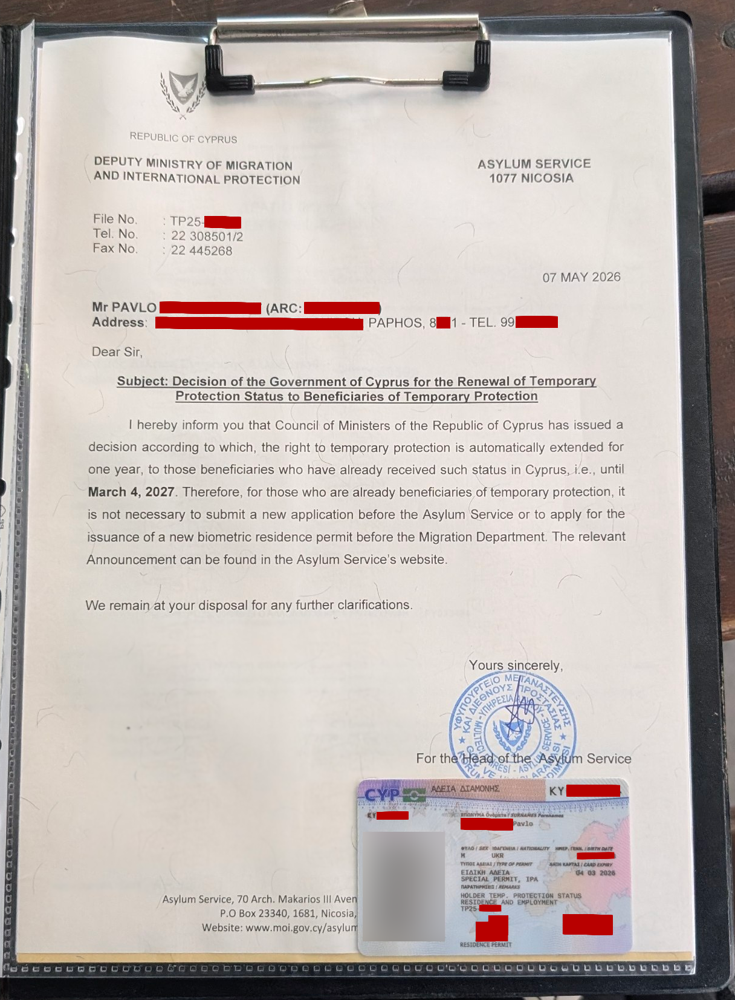

# Продовження тимчасового захисту

## Про продовження тимчасового захисту

Загалом, продовження тимчасового захисту надається автоматично, якщо ви вже маєте статус тимчасового захисту, вам не потрібно подавати нову заявку, оновлювати нову картку Residence Permit, тощо.

Наразі тимчасовий захист було продовжено до 4 березня 2027 року.

Однак, служба у справах притулку (Asylum Service) прохає бенефіціарів тимчасового захисту звернутись до їх головного офісу в Нікосії для отримання повідомлення про продовження.

## Отримання повідомлення про продовження

Щоб отримати повідомлення про продовження тимчасового захисту, необхідно звернутись до головного офісу служби у справах притулку [(Asylum Service) в Нікосії](./addresses.md#asylum-service). (Те саме місце де ви отримували свій статус ТЗ)

При собі необхідно мати:

- Посвідку на проживання (Residence Permit);
- Паспорт громадянина України для виїзду за кордон;
- Свідоцтво про шлюб (за наявності);
- Свідоцтво про народження неповнолітніх дітей (за наявності);

У випадку отримання повідомлення сім'ями, усі члени родини, окрім неповнолітніх дітей, повинні з'явитися особисто для отримання повідомлення про продовження тимчасового захисту.

Окрім сухої інформації про те як отримати повідомлення, деяка додаткова інформація стосовно самої процедури від спільноти:

!!! quote "Відгук №1"

    В мене вчора також зайняло близько 1.5 години, хоча дехто отримував і швидше, за 40-45 хвилин. Заповнюється анкета (бланк видадуть на місці), і віддається у віконце разом з пластиком, через деякий час отримаєте назад пластик та документ о продовженні.

Зовнішній вигляд повідомлення про продовження тимчасового захисту:

<figure markdown="span">
{ loading="lazy" width="50%" }
<figcaption>Повідомлення про продовження тимчасового захисту від 2026-05-07</figcaption>

</figure>

## Джерела

1. Інформація про місце звернення та необхідні документи була отримана з [сайту Asylum Service](https://www.gov.cy/mip-as/en/uncategorized/temporary-protection-extension-announcement/ "ОГОЛОШЕННЯ ЩОДО ПРОДОВЖЕННЯ ТИМЧАСОВОГО ЗАХИСТУ"),
   цю сторінку, окрім отримання інформації про те як отримати повідомлення про продовження ТЗ можна використовувати як аргумент у спілкуванні з підтримкою різних сервісів на користь того що ТЗ було продовжено,
   і що ваш Residence Permit є дійсним до 4 березня 2027 року;
2. [Відгук №1](https://t.me/uacyprus/238563/620050).